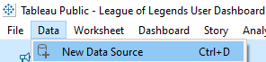

# League of Legends Data Fetcher

Welcome to the League of Legends Data Fetcher! 🎉

This repository is meant to save the code used to extract your Lol data which can then be used to find insights on your match history with a [cool Tableau dashboard](https://public.tableau.com/app/profile/ruiarpereira/viz/LeagueofLegendsUserDashboard/MainDashboardDarkMode)! :)


## Features
- Fetch match data using [Riot's API](https://developer.riotgames.com/), time spent per champion, spells used, KDA, Win Rate & more.
- Merge and clean data to prepare for dashboard.
- Output data in Excel format for easy use in [Tableau](https://public.tableau.com/app/discover).

## Assumptions
In this README I will assume that you already have a League of Legends account with games played on it. If you don't, well, then don't create one. You're probably better off without it.

## What is Riot's API?
Riot Games API Fetcher is a simple yet powerful tool designed to interact with the vast data ecosystem provided by Riot Games. Whether you're building your own League of Legends stats tracker, analyzing Legends of Runeterra matches, or exploring other Riot titles, this API fetcher provides easy access to in-game data for developers and enthusiasts alike.

For running the code you'll need to use your own API key. But don't worry, you can find how to get it [here](getting_started/with_RiotAPI/create_API_key.md).

## What is Tableau?
Tableau is a data visualization software that helps users create interactive and shareable visualizations from complex datasets.

For this project I used Tableau Public, which is a free version of Tableau that allows users to publish and share their visualizations online with the public.
You can read more about Tableau Public [here](https://www.tableau.com/blog/beginners-guide-tableau-public).

## Installation
To set up this project locally, follow these steps:
1. Clone the repository:
   ```
   git clone https://github.com/yourusername/lol-data-fetcher.git
   ```
2. Navigate to the project directory:
   ```
   cd lol-data-fetcher
   ```
3. Update the `config example.json` [file](config_example.json) with your Riot Username, API Key, Tagline and Region, as well as changing that file name to `config.json`. Here's an example:
   ```
   "RIOT_ID_NAME": "Tyains",
    "TAG_LINE": "EUW",
    "SUMMONER_REGION": "europe",
    "API_KEY": "YOUR_API_KEY",
   ```

If you want to know how to find your Username, Tagline and Summoner Region, [refer to this page](getting_started/with_RiotAPI/find_user_info.md).

For more information on the installation:
- [Riot API](getting_started/with_RiotAPI/)
- [Tableau](getting_started/with_Tableau/)


## Usage
To run the data fetcher, execute the code on `main.py` located in the `extract_folder`.

This will create several Excel files which will then be used for the Tableau Dashboard such as:

- **matches_extract_{username}.xlsx** - Main file, containing all match information, with 1 row per Match ID
- **kills_extract_{username}.xlsx** - Aggregated Kill type information, with the number of Kills per Champion/Kill Type
- **spells_extract_{username}.xlsx** - Aggregated Spell type information, with the number of Spells per Champion/Spell Type
- **damage_extract_{username}.xlsx** - Aggregated Damage type information, with the total Damage per Champion/Damage Type

**Note** - Due to Riot's API limitations, you are only able to extract at most the last 1000 games

## Making use of the data

After executing the script, you should have the above mentioned Excel files. *Now what?*

Well, first you need to have Tableau Public installed, as well as a Tableau account created ([more info here](getting_started/with_Tableau/create_TableauPublic_account)).
Head to the [Tableau dashboard](https://public.tableau.com/app/profile/ruiarpereira/viz/LeagueofLegendsUserDashboard/MainDashboardDarkMode), hit the download button and choose the *Tableau Workbook* option. After that, open it with the Tableau Public application.

Unfortunately, Tableau Public does not allow to share a file with the Tableau Data Source, so you'll have to create your own and replace the existing data source with yours. But don't worry, I'm here to help with that!

1. Open the Tableau workbook

2. Click on Data > New Data Source (or *Ctrl+D*)

    
3. Select the *Microsoft Excel* option

    

4. Select the `matches_extract_{username}.xlsx` file that you created with the script. That will take you to this page:

    

5. Add the other 3 Excel files by clicking in 'Add' in Connections > Microsoft Excel > file_name.xlsx.

    

    After adding them, you should see something similar to this:

    


6. Drag the 'Sheet1' for each of the 3 Excel files over to the canvas near the existing original Sheet1. Make sure a relationship between them is created by making a sort of string connect them:

   

   After dragging all, you should see this:

   

   **Note** The connection *should* automatically detect that `Champion` is the field that creates the relationship between each Sheet. 
   If it doesn't, select `Champion`for each Sheet on the bottom left corner like so:

   

07. Open a new worksheet by clicking  

08. Select Data > Replace Data Source. Then in *Current* select 'League of Legends Data' and for *Replacement* select the newly created data source and click OK

    

After that, you're good to go! Now the dashboard is all ready for you to hopefully get some interesting insights out of your matchG history!

Unfortunately the replacement of the data source makes so that some default features such as coloring and sorting are lost, but feel free to redo them with your own taste, or contact me with any questions!

If you intend to refresh the data in the future, that's easier and quicker!
Simply rerun the script, which will bring the missing scrobbles. After that, go into your dashboard, right click your data source, followed by *Refresh*.